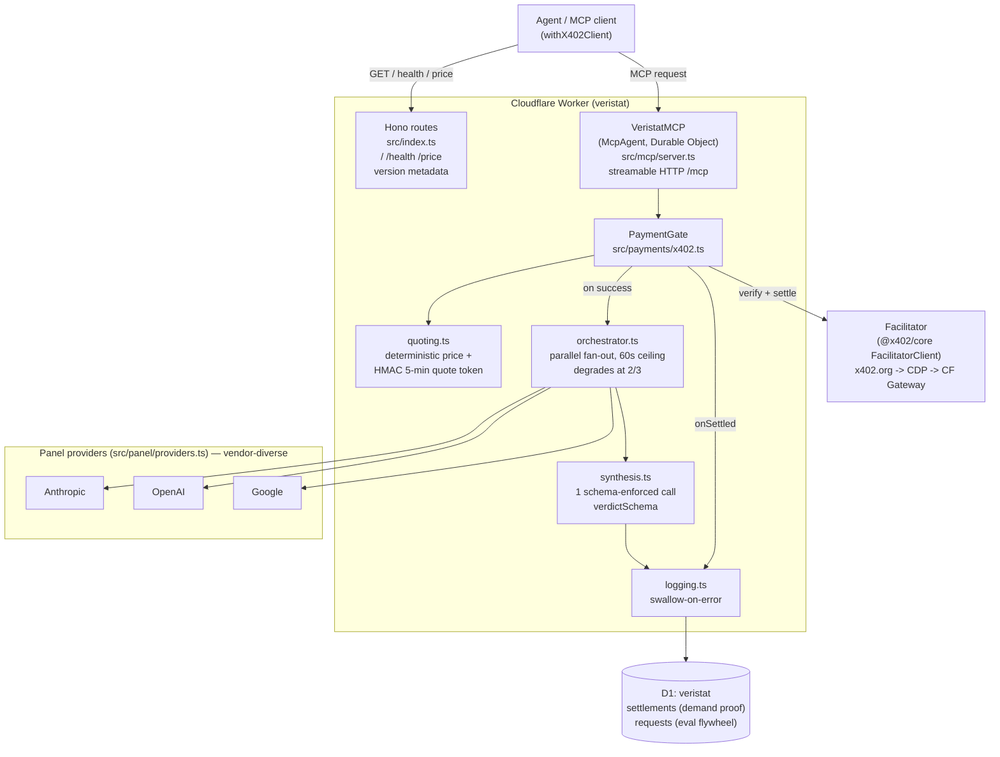
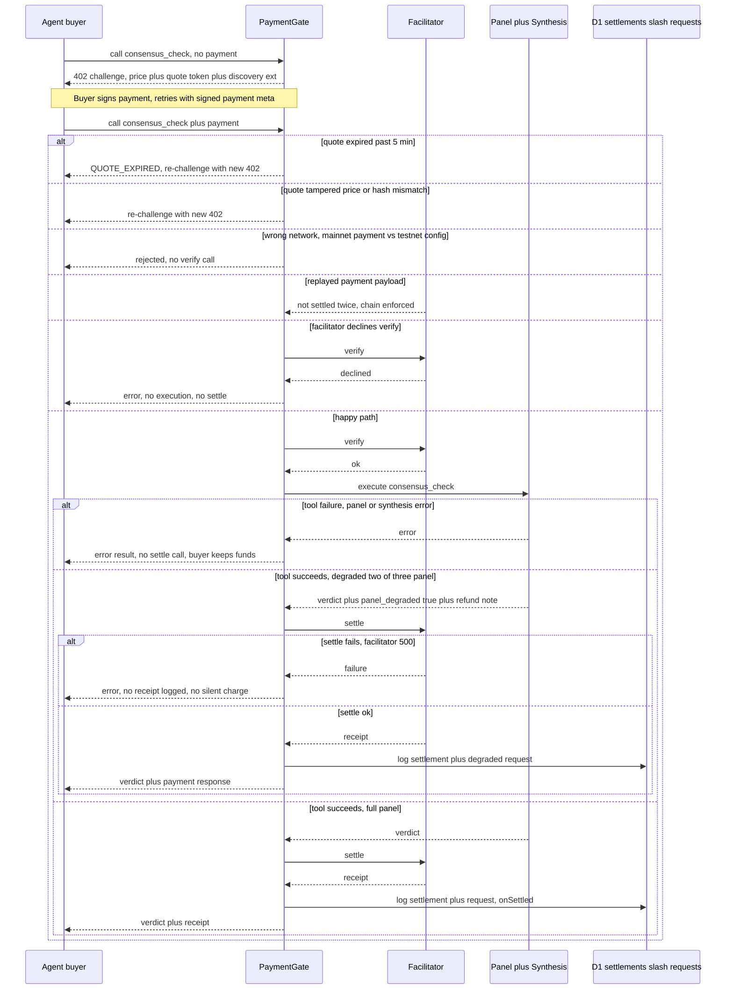
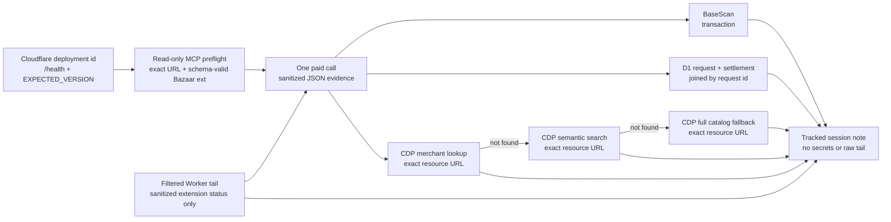

# ARCHITECTURE — Cloudflare layout and payment flow

Companion to `CLAUDE.md`'s Architecture section — diagrams, not prose. Render
natively on GitHub; source of truth for the code is still the files named in
each box.

## Cloudflare architecture

Key seams: the facilitator is injected via `FacilitatorClient`
(`src/payments/x402.ts`) — swapping x402.org → CDP → Cloudflare Monetization
Gateway is a constructor argument, not a rewrite (`docs/RUNBOOK.md`
facilitator swap procedure). Panel vendor diversity is enforced in
`src/panel/providers.ts` — never two models from one vendor.

## Payment flow (happy path + tested failure branches)

Branches below map 1:1 to `docs/TESTING.md`'s negative-path matrix
(`test/x402.test.ts`) — this is that matrix as a picture.

Invariant this diagram exists to make visible: **settlement only happens
after the tool callback succeeds** — every failure branch above either never
reaches `Fac->>Gate: settle` or fails before `D1` is written. A settlement
row in D1 without a matching verdict is a release blocker, not a flake
(`docs/TESTING.md` invariant #1).

## Bazaar rehearsal evidence flow

Discovery status is intentionally assembled from several narrow sources. No
single signal is sufficient: `processing` is nonterminal, a chain transaction
does not prove catalog visibility, and a catalog miss does not invalidate a
successful settlement.

The discovery checks run at +10, +30, and +60 minutes. At +60, an exact URL
match closes the Phase 2 gate; a miss produces an issue #2112 evidence package
and leaves mainnet blocked unless the operator records the narrow waiver in
`docs/ROADMAP.md`. Secret exclusions and commands live in `docs/RUNBOOK.md`.
